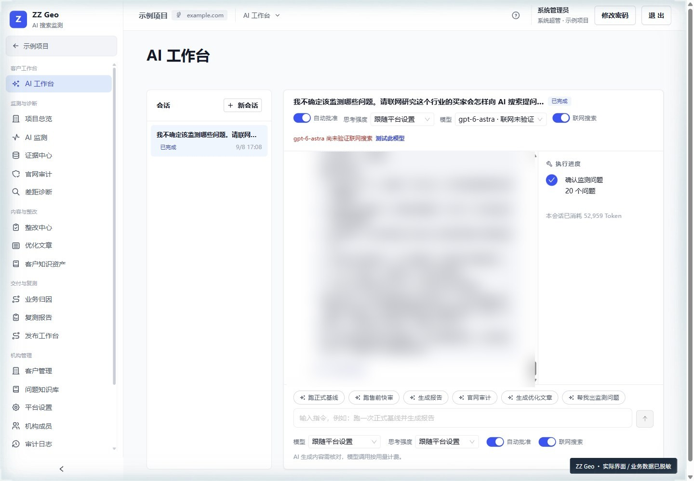
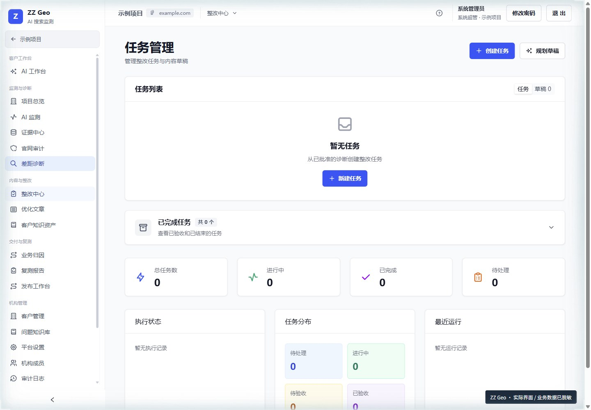
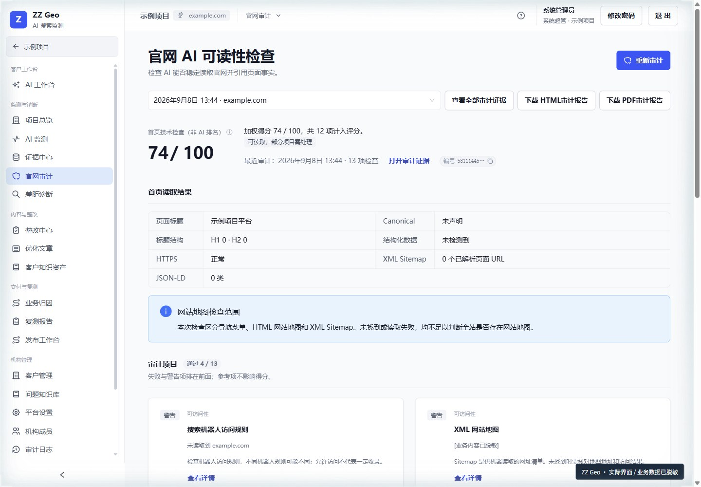
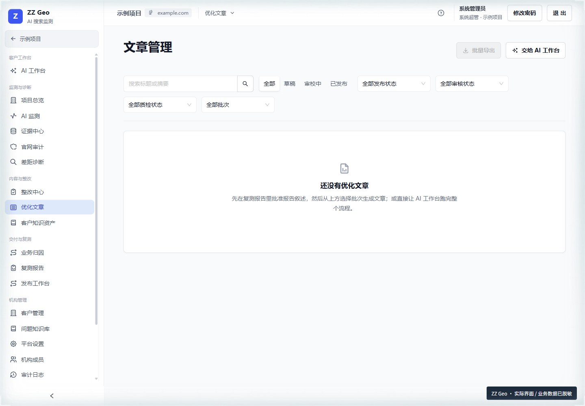

<div align="center">

# ZZ Geo


**品牌有没有出现在 AI 回答里？用证据看清，再动手优化。**  
**Is your brand showing up in AI answers? Find the evidence, then improve.**

[交互演示 / Interactive demo](https://www.honesttai.com/interactive/preview.html) · [GitHub](https://github.com/honestTai/geo-console) · [HRouter](https://hrouter.net/home)

</div>

**AGPL-3.0 · 自行部署 / Self-hosted**

[官网 / Website](https://www.honesttai.com/) · [帮助中心 / Help](https://www.honesttai.com/help/) · [快速开始 / Quick start](#快速开始)

把品牌提及、回答来源、官网审计、内容整改与复测报告放在同一套工作台里，让每次优化都能回到具体问题和原始证据。

Bring brand mentions, answer sources, website audits, content improvements, and retest reports into one evidence-led workspace.

**适合谁 / Who it’s for**  
品牌运营、内容团队与 GEO 服务机构。  
Brand teams, content teams, and GEO service providers.

供应商联网 API 采样不等同于消费端 App 实际回答。同配置复测用于比较，不单独证明整改效果。  
Sampling uses provider APIs, not consumer-app answers. Matched retests support comparison, not causal proof.

## 解决什么问题

AI 是否提到了品牌？明确推荐和普通提及有什么不同？回答引用了哪些网页？内容应该先改哪里？整改后，哪些变化可以合理比较？


系统保存原文、冻结配置、来源、审批与报告快照，让团队回到具体证据核对结论。失败、未知和缺失不会被合成数据补齐。

## 界面预览

| AI 工作台 | 整改中心 |
| --- | --- |
|  |  |
| 官网审计 | 优化文章 |
|  |  |

图片来自 2026-09-09 实际系统界面，业务数据已脱敏，空状态如实保留，不构成客户效果证明。更多页面见[图文操作手册](docs/user-guide.md)。

## 核心能力

| 能力 | 工作方式 |
| --- | --- |
| 客户与问题研究 | 管理客户、竞品、品牌别名和问题候选，成员确认正式监测范围 |
| 多平台采样 | DeepSeek、Kimi、豆包火山方舟、通义千问 DashScope、元宝搜索源 + 混元合成 |
| 证据与指标 | 回答原文留档，区分搜索来源和最终引用，解释提及、明确推荐及有效分母 |
| 官网审计与整改 | 保留网页源文件、截图和审计证据，生成可定位、可分配、可验收的任务 |
| Agent 工作台 | 自然语言组织工作，执行项目范围内的受控工具，结构化草稿按要求人工审批 |
| 内容运营 | 客户知识修订、文章版本、内容审核、质检门禁和人工发布回执 |
| 复测与报告 | 复用完整基线配置，冻结报告快照并生成在线报告、PDF 和 Word |
| 团队协作 | 机构、角色和客户范围授权，保留审计与运行日志 |

**采样口径：**数据来自供应商联网 API，不等同于消费端 App 的实际回答。元宝渠道采用“元宝搜索源 + 混元合成”。同配置复测减少条件差异，但不能单独证明整改的因果效果，不保证收录或排名。

## 快速开始

只想先运行起来，可以使用 [Docker 一键启动](docs/docker-quickstart.md)：

```bash
bash docker/quickstart/start.sh
```

Windows：`powershell -ExecutionPolicy Bypass -File docker/quickstart/start.ps1`。首次填写管理员邮箱，脚本生成随机密钥并启动九个服务。下面是本地源码开发方式。

要求 Node.js 24、Corepack、pnpm 11。以下命令在完整源码根目录执行。本地开发推荐 macOS、Linux 或 Windows WSL；PGlite 仅用于本地开发与测试。

```bash
corepack pnpm install --frozen-lockfile
corepack pnpm --filter @geo/worker exec playwright install chromium
```

macOS 使用系统钥匙串保存主密钥。Linux/WSL 先提供一个安全保存的 32 字节 Base64 主密钥，并指定新的独立数据目录：

```bash
export GEO_DATA_DIR="$PWD/.geo-data"
# 仅首次初始化生成；请安全保存并在后续启动使用同一个值。
export GEO_MASTER_KEY="$(node -e "process.stdout.write(require('node:crypto').randomBytes(32).toString('base64'))")"
corepack pnpm geo setup
corepack pnpm geo start
```

默认开发工作台在本机 3000 端口的应用路径，启动命令会打印地址。启动前确认没有指向既有外部数据库的 `DATABASE_URL`；首次使用请保持未设置，使用新建 PGlite。不要每次重启重新生成主密钥，否则无法解密已保存的供应商凭据。

进入系统后先在平台设置配置供应商和 HRouter 模型，再建立客户与问题范围。采集、联网测试和模型调用可能产生费用。当前 CLI 在原生 Windows 下的进程调用兼容性有限，建议使用 WSL。

服务器部署、备份、更新与回滚见[部署文档](docs/deployment.md)。操作系统、Node、数据库及模型/API 服务是必要运行环境。

## 文档与开发

- [操作手册](docs/user-guide.md)：21 个章节、20 张实际界面截图。
- [架构与数据边界](docs/architecture.md)：服务分工、证据与授权边界。
- [指标口径](docs/visibility-measurement-v2.md)：分母、汇总和比较条件。
- [供应商适配](docs/search-provider-adapters.md)：API 与采集协议。
- [部署](docs/deployment.md)与[运维](docs/operations.md)：服务器安装、恢复与排障。
- [贡献指南](CONTRIBUTING.md)：贡献与验证要求。

```bash
corepack pnpm check-types
corepack pnpm test
corepack pnpm build
corepack pnpm lint
corepack pnpm license-check
```

## 开源协议与商业使用

项目自有源码采用 [AGPL-3.0-only](LICENSE.md)，允许依协议使用、修改、部署和商业使用。企业内部业务、客户服务和收费服务本身不会产生购买额外软件许可证的要求。

修改版通过网络与用户交互时，应按 AGPL 第 13 条向这些用户显著提供对应源码的免费获取方式。分发时也需履行适用条款；具体义务以许可证全文为准。第三方代码保留原许可，详见 [NOTICE](NOTICE) 与[第三方声明](THIRD_PARTY_NOTICES.md)。

开源不等于公开客户数据、账号、密钥、数据库和原始采集证据。服务器、存储和第三方 API 费用由使用者承担。

## 体验与技术服务

官方体验环境采用人工开通方式，不在公开文档中提供登录地址。请说明团队、用途和希望体验的流程，通过 **[honest.tai@outlook.com](mailto:honest.tai@outlook.com?subject=ZZ%20Geo%20申请体验账号)** 私下申请账号。

部署、培训、维护、定制开发及赞助合作也可联系同一邮箱。服务是可选项，不是使用开源功能的前置条件；范围、周期和费用另行约定。

## 作者与 HRouter · About the author

我是 **honestTai**，开发工具，也运营 [HRouter](https://hrouter.net/home)。这里持续分享实用代码、AI 应用、Skills 与插件，把工作中的需求变成可复用的项目。  
I’m **honestTai**, the developer and operator behind HRouter. I share practical code, AI apps, skills, and plugins built around real workflows.

需要为 AI 编程或应用开发选择模型服务？HRouter 是我运营的模型路由服务。项目的供应商选择与接入方式见下方配置说明。  
Building with AI? HRouter is my model-routing service for AI coding and applications. Follow this project’s configuration guide when choosing a model provider.

[了解 HRouter · Explore HRouter](https://hrouter.net/home) · [发现更多项目 · More projects](https://github.com/honestTai)

**觉得有用，欢迎 Star；有想法，欢迎到 Issues 交流。**  
**Star the project if it helps, and share your ideas in Issues.**
