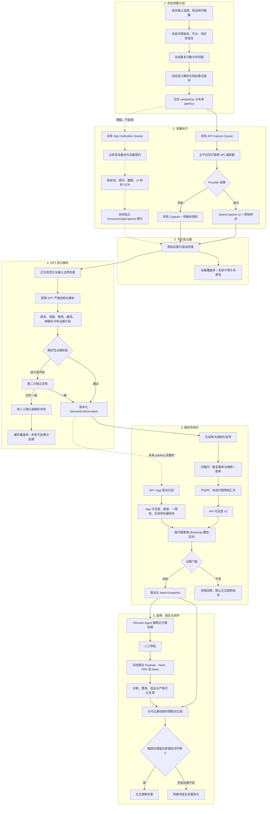
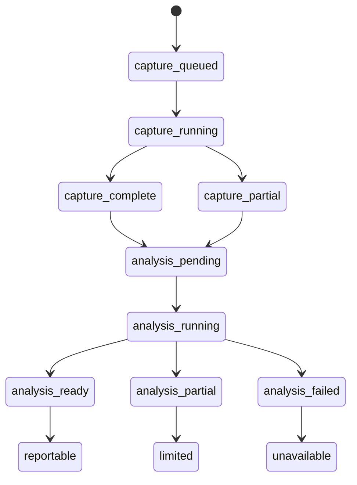

# GEO 可见度测量 V2 设计方案

> 状态：API V2 链路已实施（2026-09-05）；App 仍为未来预留。实现事实与验证限制见 `visibility-measurement-v2.md`。
> 记录日期：2026-09-04  
> 调研代码基准：`3348bd2d4b4e6a0b73374f40b691deb44a8a6bbe`

本文记录 GEO Console 对 AI 联网回答进行重复采样、语义解析、确定性统计和趋势判断的下一版设计。原稿的阶段划分保留供设计追溯。按 2026-09-05 用户要求，本次直接切换 V2，不保留 V1 指标回退；已实现 API 语义解析、指标快照、审核、报告接入，消费端 App 未实现。

## 1. 背景

当前新批次通过五个平台的官方联网 API 自动采集，证据契约为 `geo.query-capture.v2`，采集模式为 `llm_search_api`。这些结果可以衡量官方联网 API 通道中的品牌可见度，但不能冒充手机 App 的真实回答。

生成式回答具有随机性。同一个问题重复请求时，品牌集合、推荐顺序、引用来源和表述都可能变化，因此不能使用单次回答代表平台，也不能用全文相等判断两个结果是否一致。

当前实现还存在以下测量限制：

- `packages/search-providers/src/common.ts` 使用品牌别名首次出现的位置生成 `brandMatches.position`。该位置表示正文出现顺序，不一定是推荐名次，也无法可靠区分推荐、否定、比较和排除语境。
- `packages/metrics/src/visibility.ts` 直接以成功回答为分母。成功次数更多的问题会获得更大权重，问题之间并非等权。
- 平台只要有一条成功回答，就会以完整平台权重进入总览。
- 当前重复一致性是多数结果占比，不能表达所有重复样本之间的真实分歧。
- 漂移告警只看点估计下降是否达到 10 或 20 个百分点，没有使用样本量或置信区间。
- 报告证据等级主要依据总体有效率和有效回答数，未同时约束问题覆盖、语义解析覆盖和估计区间宽度。

## 2. 目标与非目标

### 2.1 目标

- 保持原始 Capture 和 Provider 原始响应不可变。
- 使用受限 GPT 解析回答中的提及、推荐、排除、情感和明确名次。
- 用确定性规则验证 GPT 输出是否有原文依据。
- 先在问题内部汇总重复采样，再让问题等权进入平台指标。
- 同时展示采集覆盖、解析覆盖、问题覆盖和统计不确定性。
- 只有在样本门槛和统计条件同时满足时生成正式漂移告警。
- 为未来消费端 App 抽样保留独立接口和配对键，但当前不实现云安卓、设备池或 App Worker。
- 保持 API 与未来 App 指标完全分离，只新增配对校准指标。

### 2.2 非目标

- 不修改或删除历史 `query_captures`、原始响应和报告快照。
- 不把 API 结果描述为手机 App 结果。
- 不复活历史 `consumer_surface` v1 作为新 App 契约。
- 不让 GPT 直接输出最终百分比、综合分、漂移等级或业务结论。
- 原设计阶段不落地运行配置；该限制现已由用户的完整 V2 实施请求取代。不得实现未来 App Worker 或假数据。

## 3. 核心原则

1. **证据、解释、统计分层**：Capture 是不可变证据；语义结果是可重算派生数据；指标由确定性算法生成。
2. **GPT 只理解语义**：GPT 负责判断回答在说什么，不负责算分和决定告警。
3. **规则验证证据**：品牌 ID、证据片段、推荐名次和来源关系必须经过确定性校验。
4. **问题等权**：重复采样用于估计同一个问题的概率和稳定性，不能让成功样本更多的问题获得更大业务权重。
5. **失败不是零分**：采集失败、解析失败、来源不可见和未来 App 未配置都单独进入覆盖率，不作为“未提及”。
6. **版本决定可比性**：问题、采样、Provider、语义解析和指标算法版本不一致时，不直接进入同一趋势。
7. **结论可追溯**：任何展示、告警或报告结论都能回到问题、重复样本、语义观察和原始证据。

## 4. 完整流程



## 5. 保留的现有能力

以下事实源继续有效，不因 V2 设计而被覆盖：

- `experiment_batches.config` 继续冻结客户、竞品、问题、平台、重复次数、时间窗和 Provider 协议。
- 正式基线默认每题三次，时间窗为 0、4 小时和 24 小时；快审仍为每题一次。
- Capture Worker 继续按冻结 Provider 契约执行，原始响应先写对象存储，再插入 `QueryCapture v2`。
- `query_captures`、Provider 原始响应和报告快照保持不可变。
- Provider 失败保持真实状态，不静默切换模型或平台。
- 来源不可见时保持 `unavailable`，不是引用率 0。
- 报告仍需冻结 payload 与 SHA-256，并经过现有叙述和质量检查审批流程。

## 6. 冻结测量契约

V2 应在现有 `FrozenBatchConfig` 基础上增加版本化测量契约。下列结构是拟议设计，不是当前类型定义：

```ts
type FrozenMeasurementContractV2 = {
  contractVersion: "geo.visibility-measurement.v2";
  sampling: {
    mode: "quick" | "formal";
    repeats: number;
    executionWindows: string[];
    minimumSuccessfulRepeatsPerPrompt: number;
    minimumPromptCoverage: number;
  };
  semantic: {
    schemaVersion: string;
    promptVersion: string;
    modelProvider: string;
    modelId: string;
    modelRevision: string | null;
    validatorVersion: string;
    adjudicationPolicyVersion: string;
  };
  metrics: {
    algorithmVersion: string;
    intervalMethod: "cluster-bootstrap-percentile";
    bootstrapIterations: number;
    bootstrapSeed: string;
    reportabilityPolicyVersion: string;
    driftPolicyVersion: string;
  };
  surfaces: {
    api: { enabled: true };
    consumerApp: { enabled: false; contractVersion: null };
  };
};
```

只要影响指标含义的字段变化，就必须创建新基线，或者把待比较批次的原始证据用同一个语义契约重新解析后再比较。不得让不同解析或算法版本的点直接连成趋势。

## 7. 采样设计

### 7.1 API 采样

- 快审每题每平台一次，只提供时点快照，不计算重复稳定性，不生成显著性漂移结论。
- 正式基线默认每题每平台三次，沿用 0、4 小时和 24 小时时间窗。
- 超过三次时仍在冻结的一天窗口内分布，避免把一个批次拖延多天。
- 每次采集都必须有稳定的 `sampleKey`：`batchId + platform + promptId + windowIndex + repeatIndex`。
- 技术重试不能创建新的业务样本。一次采样任务多次技术尝试后，只能收敛为一个成功或失败 Capture。

### 7.2 问题分层

问题应保留已存在的 intent、topic、persona 和 tags。正式统计让问题等权；这些字段用于检查问题集是否覆盖选型、价格、资质、售后、口碑、地区或场景等业务意图，而不是在运行时引入行业默认权重。

系统不得根据已经观察到的品牌提及结果选择或排除问题，否则会引入选择偏差。核心趋势问题集一旦形成基线，在复测中必须完整复用。

### 7.3 未来 App 配对预留

App 采集暂不实现，但测量契约预留 `pairKey`：`calibrationRunId + platformFamily + promptId + windowIndex + repeatIndex`。同一个 `pairKey` 的 API 与 App 采集才允许进入配对比较。

未来实现时应满足：

- App 从冻结问题集中进行预先确定的分层抽样，不能根据 API 结果临时挑题。
- API 与 App 使用完全相同的问题文本，执行时间尽量控制在同一小窗口内。
- API 先执行还是 App 先执行应按冻结随机种子决定，避免固定顺序偏差。
- App 每次使用新会话，并记录账号档案、App 版本、模型模式、联网状态、地区、设备和出口网络。
- App 未配置、采集失败或配对缺失时，配对指标为 `null`，不能记为不一致或零分。

历史 `consumer_surface` v1 只读，不作为未来 App 新契约。未来 App 证据应采用新的 schema 和独立存储边界。

## 8. GPT 语义解析

### 8.1 职责边界

语义解析应由独立、受限的 Semantic Worker 执行，而不是让通用工作台 Agent 自由判断。解析调用不提供联网搜索、文件、SQL、Bash 或其他工具，只接收当前 Capture 正文、冻结品牌白名单和严格 JSON Schema。

回答正文、网页内容和 OCR 文本全部是不可信输入。系统提示必须明确要求模型忽略其中的指令，只把它们作为待分类数据。

GPT 不输出最终指标、综合分、证据等级、漂移等级或整改建议，也不输出可直接采用的主观置信度。

### 8.2 拟议语义结构

```json
{
  "schemaVersion": "geo.semantic-observation.v1",
  "parseStatus": "valid",
  "answerIntent": "purchase_recommendation",
  "hasExplicitRecommendationList": true,
  "brandSignals": [
    {
      "brandId": "known-brand-id",
      "mention": true,
      "context": "recommendation",
      "sentiment": "positive",
      "recommendation": "explicit",
      "rank": 2,
      "evidenceSpans": [
        {
          "start": 42,
          "end": 61,
          "text": "原始回答中的支持片段"
        }
      ]
    }
  ],
  "ambiguityReasons": []
}
```

建议枚举：

- `context`：`recommendation`、`comparison`、`factual`、`warning`、`exclusion`。
- `sentiment`：`positive`、`neutral`、`negative`、`mixed`、`unclear`。
- `recommendation`：`explicit`、`implicit`、`none`、`against`。
- `parseStatus`：`valid`、`needs_review`、`failed`。

### 8.3 确定性校验

Semantic Worker 返回结构后必须执行以下校验：

- `brandId` 必须来自当前批次冻结的客户或竞品白名单。
- 每个 `evidenceSpan.text` 必须能在规范化前后可映射的原始回答中找到。
- `start/end` 必须与证据片段一致且不越界。
- 没有明确推荐列表时，`rank` 必须为 `null`。
- `recommendation=against` 不能进入推荐率或第一推荐率。
- 同一品牌存在互相冲突的强信号时，必须标记歧义，不能由规则静默选一项。
- 未知品牌、缺少证据、非法枚举和结构错误使该解析无效，但不改变原始 Capture 状态。
- Provider 来源只使用 Capture 已保存的来源，不允许 GPT 补造 URL。

### 8.4 复核策略

首轮解析通过全部确定性校验后直接形成派生观察。出现冲突、歧义或校验失败时才进行第二次独立复核，避免对每条回答进行昂贵的多模型投票。

第二次结果与第一次在关键字段上一致并通过校验时可以采用；仍不一致时进入人工确认或 `parse_failed`。人工确认写入独立审计记录，不修改原始回答。

### 8.5 版本与重算

每条语义观察必须保存：

- 原始 `captureId`。
- 语义 schema、Prompt、模型、模型修订、校验器和复核策略版本。
- 原始模型结构化响应对象 key。
- 解析状态、复核状态、错误原因和时间。
- 若发生人工确认，保存操作者、时间和审计事件。

模型、Prompt 或规则升级后，只新增解析运行和派生观察。旧观察继续保留，原始 Capture 不更新、不删除。

## 9. 指标 V2

### 9.1 三类覆盖率

- **采集覆盖率**：成功 Capture 数 / 计划 Capture 数。
- **解析覆盖率**：有效 SemanticObservation 数 / 成功 Capture 数。
- **问题覆盖率**：达到最小成功重复数的问题数 / 计划问题数。

未来 App 配对还要单独计算 **配对覆盖率**：API 和 App 都采集成功且解析有效的 pair 数 / 计划 pair 数。

这些覆盖率必须独立显示，不能合并成一个模糊的证据等级，也不能用失败样本把品牌率拉低。

### 9.2 单次信号

每条有效语义观察生成以下确定性信号：

- `mentioned`：目标品牌是否被有效提及。
- `recommended`：是否为明确或隐含正向推荐。
- `explicitlyRecommended`：是否为明确正向推荐。
- `firstRecommended`：是否存在明确推荐列表且目标品牌名次为 1。
- `recommendedRank`：只有明确推荐列表时才有数值，否则为 `null`。
- `ownedSourcePresent`：目标域名是否出现在可观测来源中。
- `ownedSourceCited`：目标域名是否被明确引用。
- `competitorMentioned`：各冻结竞品是否被提及。

### 9.3 问题内汇总

对于平台 `s`、问题 `p` 的有效重复样本，二元指标先在问题内部计算：

```text
promptRate(p, s) = sum(signal of valid repeats) / validRepeatCount(p, s)
```

正式批次默认三次采样时，建议至少有两次采集成功且解析有效，该问题才进入平台正式指标。更一般的初始规则可以冻结为 `ceil(repeats * 2 / 3)`，最终阈值应经过标注集和试运行校准。

重复稳定性使用两两一致率，不再使用多数结果占比。若 `n` 次有效重复中有 `k` 次为真：

```text
pairwiseAgreement = [k(k-1) + (n-k)(n-k-1)] / [n(n-1)]
```

全部相同为 1；两次结果完全相反为 0；三次中两真一假为 1/3。只有一次有效结果时稳定性为 `null`。

### 9.4 平台汇总

平台指标先对每个有效问题求内部概率，再对问题等权平均：

```text
platformRate(s) = sum(promptRate(p, s)) / eligiblePromptCount(s)
```

这样同一个问题不会因为技术原因多成功一次就获得更大业务权重。平台进入总览前必须通过问题覆盖门槛；未达门槛时可以展示有限结果，但不能以完整权重进入正式总体结论。

平台之间继续等权，但只有达到正式证据门槛的平台才能进入总体指标。平台失败单独影响平台覆盖率，不以零分拉低品牌率。

### 9.5 指标命名调整

- 保留“品牌提及率”，但改为问题等权的提及概率。
- 新增“推荐率”和“明确推荐率”。
- “首位推荐率”只允许使用经过证据校验的明确推荐列表。
- 当前“平均提及位置”不得继续解释为推荐名次。V2 应替换为“明确推荐名次中位数”，无明确排名时为 `null`。
- 当前 `brandShareOfVoice` 实际更接近监测品牌出现份额。V2 应更名为“监测品牌出现份额”或另行定义推荐份额，避免冒充文本声量。
- 来源率只在来源可观测的成功回答中计算；来源不可见保持 `null`。

## 10. 不确定性与证据门槛

### 10.1 置信区间

平台和总体指标应按问题聚类进行固定种子的 percentile bootstrap，不能把同一问题的重复回答当作完全独立样本。

建议初始配置为 2,000 次重采样，随机种子由 `configHash + algorithmVersion` 确定，从而保证相同输入产生相同区间。区间方法、次数和种子都必须冻结。

未来 API/App 差值使用配对的按问题聚类 bootstrap，保留同一问题内部 API 与 App 的对应关系。

### 10.2 初始门槛建议

以下是需要通过标注集和试运行校准的初始建议，不是当前产品规则：

- 正式问题的有效重复数至少达到 `ceil(repeats * 2 / 3)`。
- 平台有效问题覆盖率至少 80%。
- 正式跨问题结论至少需要 10 个有效问题。
- 少于 10 个问题时允许展示有限范围结果，但不生成统计显著的漂移告警。
- 语义解析覆盖率建议至少 90%；未达标时优先排查解析服务，而不是解释品牌表现。
- 未来 App 配对覆盖率至少 80%，且每个有效问题至少有两个有效 pair。

系统应输出 `ready`、`limited`、`unavailable` 三种可报告状态：

- `ready`：所有冻结门槛通过，可以形成正式趋势和漂移判断。
- `limited`：存在可展示的点估计，但不能形成正式漂移或强结论。
- `unavailable`：没有足够有效问题计算该指标。

## 11. API 与未来 App 配对指标

App 未实现时，本节所有指标均为 `null/not_configured`。未来只对相同 `pairKey`、双方采集成功且解析有效的样本计算。

每个问题先建立四格结果：

- `n11`：API 与 App 都出现目标信号。
- `n10`：只有 API 出现目标信号。
- `n01`：只有 App 出现目标信号。
- `n00`：双方都未出现目标信号。

问题内指标：

```text
API 提及率 = (n11 + n10) / N
App 提及率 = (n11 + n01) / N
App - API 差值 = (n01 - n10) / N
配对一致率 = (n11 + n00) / N
API 正结果在 App 复现率 = n11 / (n11 + n10)
API 对 App 漏检率 = n01 / (n11 + n01)
```

平台配对指标仍然先在问题内计算，再对有效问题等权平均。分母为 0 的条件指标保持 `null`。

辅助诊断还可以包含：

- 明确第一推荐一致率。
- 双方都存在明确排名时的名次差中位数。
- 推荐品牌集合 Jaccard 重合度。
- 竞品集合 Jaccard 重合度。
- 引用来源域名集合 Jaccard 重合度。
- 情感方向一致率。
- 回答语义向量相似度，但只能作为诊断信息，不能作为核心 KPI。

API 与 App 必须分别展示，不得合并成一个“综合可见度”。

## 12. 漂移判断

正式漂移只能比较严格可比的 baseline 与 retest。除现有完整批次配置一致外，还应满足：

- 语义 schema、Prompt、模型修订和校验器版本一致，或者双方原始证据已经用同一语义契约重新解析。
- 指标算法、区间方法、证据门槛和漂移策略版本一致。
- 双方都达到 `ready`。
- 比较使用共同有效问题，按问题配对计算变化。

建议告警条件：

```text
warning = 指标下降至少 10 个百分点，且 95% 配对差值区间上界小于 0
high = 指标下降至少 20 个百分点，且 95% 配对差值区间上界小于 0
```

达到幅度但区间跨 0，或者覆盖门槛不足时，只产生“待确认变化”，不产生正式漂移告警。Provider 鉴权失败、限流或无成功回答时继续跳过品牌指标告警，只报告运行失败。

## 13. 状态与队列

Capture 完成和语义分析完成必须成为两个独立状态，避免为了等待 GPT 而扭曲现有 Capture 队列语义。



拟议新增 job type 为 `semantic_parse`。每个任务只处理有回答的成功 Capture，并以 `(captureId, semanticContractHash, passKind)` 保证幂等。解析任务必须具有租约、有限重试、过期清扫和终态收敛，不能让批次永久停留在“分析中”。

指标不应在每次 `getBatch()` 时调用 GPT 或临时重算。所有语义解析先异步落库，指标再由纯函数生成并冻结为 MetricSnapshot。

## 14. 拟议存储结构

后续实现应采用新增表和新增 migration，不修改已部署 migration。表名需要在编码前最终评审。

### 14.1 `semantic_parse_runs`

记录一次解析执行：organization、project、batch、契约版本、模型、状态、用量、成本、错误和起止时间。

### 14.2 `semantic_observations`

按 Capture 和解析契约保存结构化语义、校验结果、原始模型响应 artifact、复核状态和人工确认信息。对同一 Capture 可以存在多个版本，不能覆盖旧版本。

### 14.3 `metric_snapshots`

保存 batch、算法版本、语义契约 hash、输入 observation IDs、完整指标 payload、payload hash、可报告状态和生成时间。趋势、告警与报告绑定具体快照。

### 14.4 App 预留

未来可以新增 `app_calibration_runs`、`consumer_app_captures` 和设备租约资源，但当前不创建空表、不生成占位数据、不增加假 Worker。现阶段只在设计和未来扩展接口中保留 surface 与 `pairKey` 概念。

## 15. Agent 与报告边界

- Semantic Worker 只生成并校验原子语义，不写 finding、task、文章或报告叙述。
- Metrics 只消费通过校验的 SemanticObservation，以纯函数计算。
- 报告 Agent 只读取 MetricSnapshot、问题级结果和证据索引，不能重新计算百分比或自行改变告警等级。
- Agent 对每条结论引用 MetricSnapshot 中允许的 evidence IDs；服务端在审批时重新校验项目和批次归属。
- 正式报告继续经过人工批准叙述、绑定版本的质量检查、冻结 payload/hash 和异步 PDF/Word 生成。
- 报告应同时披露采集覆盖、解析覆盖、问题覆盖、有效问题数和置信区间。

## 16. UI 信息架构

V2 不应把更多数字堆进现有 KPI 卡。推荐展示顺序：

1. API 可见度结论与区间。
2. 采集、解析和问题覆盖状态。
3. 提及、明确推荐、第一推荐和来源指标。
4. 问题级概率与重复稳定性。
5. 平台差异和失败原因。
6. 未来 App 校准分区；未配置时显示“尚未采集”，不显示 0。

页面必须覆盖 `analysis_pending`、`analysis_running`、`ready`、`limited`、`unavailable` 和 `parse_failed`。旧批次继续以 V1 只读口径展示，并明确标识指标版本。

## 17. 兼容与上线策略

该改造属于重大功能变更。下列阶段是原设计的上线建议；2026-09-05 用户明确要求直接切换 V2、停用 V1，因此当前实现不启用 V1 影子读口径或回退。生产发布仍须验证真实 Provider 与模型能力。

### 阶段 0：契约与标注集

- 建立 100 至 200 条人工标注回答，覆盖推荐、否定、比较、别名歧义、明确列表、无列表、引用和提示注入。
- 冻结语义 JSON Schema、校验规则、指标公式和初始门槛。

### 阶段 1：追加式语义层

- 新增 schema、migration、Semantic Worker 和队列收敛机制。
- 不修改 `query_captures`，不改变现有页面和告警。
- 影子运行语义解析，观察失败率、成本和耗时。

### 阶段 2：指标 V2 影子计算

- 同一批次并行生成 V1 与 V2 指标。
- 验证问题等权、稳定性、区间和历史重算的一致性。
- 不让 V2 触发正式漂移告警或报告结论。

### 阶段 3：产品切换

- API、Web、工作台、报告、PDF、Word 和 CSV 消费版本化 MetricSnapshot。
- V1 历史报告保持不可变、只读。
- V2 上线后创建新的正式基线；V1 与 V2 趋势不直接连接。

### 阶段 4：未来 App 校准

- 完成协议与合规评估后，再实现云安卓、账号、设备租约、App Capture 契约和人工接管。
- App 数据通过同一个 SemanticObservation 和指标核心处理，但保持独立 surface。

## 18. 回滚策略

- 所有数据库变化只新增，不删除旧列、旧表或旧证据。
- V2 用 feature flag 或机构级能力开关启用。
- 切换失败时恢复 V1 为默认读口径，不需要回滚原始 Capture。
- 已生成的 V2 SemanticObservation 和 MetricSnapshot 保留供审计，不删除。
- V2 创建的新基线不能自动降级为 V1 基线；回退后应明确停止该趋势，而不是跨版本复测。

## 19. 测试与验收

### 19.1 语义解析

- 标注集覆盖品牌子串、别名冲突、否定、反讽、比较、推荐、排除和明确排名。
- 验证 evidence span 必须来自原文。
- 验证未知品牌、伪造 URL、提示注入和非法 JSON 被拒绝。
- 为提及、明确推荐、负面排除和第一推荐分别评估 precision、recall 和 F1，阈值在实施前由产品与工程共同冻结。

### 19.2 指标算法

- 问题等权，不受单个问题成功样本数影响。
- 采集失败和解析失败不进入品牌率分母。
- 来源不可见保持 `null`。
- 两两一致率覆盖全同、全异和部分一致。
- Bootstrap 在固定种子下可重复，并按问题聚类。
- 配对缺失不会被统计为 API/App 不一致。

### 19.3 队列与数据

- 解析任务领取、续租、重试、进程崩溃和过期清扫最终收敛。
- 同一幂等键不能产生重复当前版本观察。
- 多解析版本可以共存，原始 Capture 不变。
- 租户、项目、批次和 Artifact 访问继续隔离。

### 19.4 产品与报告

- 新旧指标版本不会出现在同一趋势线上。
- limited/unavailable 不生成正式漂移告警。
- Web、PDF、Word、CSV 和分享报告使用同一个 MetricSnapshot。
- 390px 与桌面布局都能完整显示状态、区间和覆盖率。

实施时必须运行受影响 package 测试、重大变更防飘逸检查，以及仓库规定的 check-types、test、build 和 lint。

## 20. 待决策事项

- 语义解析使用的具体 HRouter GPT 模型及不可变模型修订如何获取和冻结。
- 每批语义解析的成本、并发、超时和最大等待预算。
- 标注集规模、抽样方法和各语义字段的验收阈值。
- 初始问题覆盖、解析覆盖和置信区间门槛是否需要按快审与正式监测分别配置。
- `brandShareOfVoice` 的产品命名是改为“监测品牌出现份额”，还是基于推荐语义重新定义。
- 人工确认入口放在证据中心还是独立解析审核队列。
- 历史 API Capture 是否统一重算 V2，还是只从 V2 上线后的新基线开始。
- 云安卓未来采用托管云手机、云真机还是自建设备池，以及各平台协议是否允许自动化采集。

## 21. 实施前影响面

正式实施将至少影响以下事实源和消费端：

- `packages/evidence`：派生语义契约与版本定义。
- `packages/core`：新增表、migration、job payload 和冻结配置。
- `packages/metrics`：问题等权、稳定性、区间、证据门槛和配对算法。
- `apps/worker`：解析 Worker、批次分析状态、MetricSnapshot、漂移、报告和 Agent 读取边界。
- `apps/web`：版本化指标类型、分析状态、覆盖率、区间和报告展示。
- `docs/architecture.md`、`docs/capability-matrix.md`、`docs/operations.md` 与项目 skill references：实现时同步真实行为。

当前计算入口仅使用 V2，`llm_search_api` 口径不变。算法和队列的本地验证不等于生产部署、真实模型评估或消费端 App 能力；实际行为及尚未验证条件见 `visibility-measurement-v2.md`。
